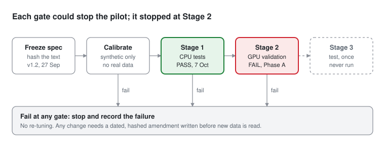
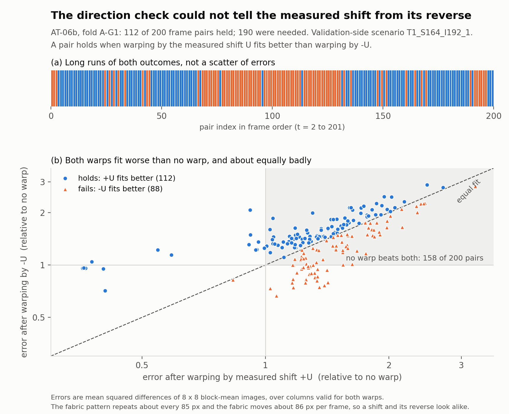

# TSFabrics alignment pilot

**A preregistered test of motion-aligned anomaly detection on knitted-fabric video, run with the test set sealed.
It stopped at validation, and this repository records exactly why.**


> **Outcome: stopped at Stage 2 (validation), as the protocol requires.** A motion-direction check failed (112 of
> 200 frame pairs, 190 required) because the validation fabric's pattern repeats about every 85 px while the fabric
> moves about 86 px per frame. Stage 3 never ran: no test label, anomaly map, score or metric was computed, so there
> is **no result about the research question**. Read the [technical note](docs/TECHNICAL_NOTE.md) for the
> two-page account, or the [final status report](docs/stage2/STAGE2_RERUN_AND_PILOT_STATUS.md) for the full record.

<p align="center"></p>

## The question

Defect detectors trained only on normal images (PatchCore and its relatives) assume a still part under a still
camera. On a circular knitting machine the fabric moves between frames. The pilot asks whether averaging normal-only
anomaly maps **at the same physical fabric location**, after aligning frames to the measured fabric motion (V4),
changes false alarms and missed defects compared with:

| Variant | What it does |
|---|---|
| V0 | single-frame anomaly score |
| V1 | temporal smoothing of the frame score |
| V2 | map averaging without alignment |
| Controls | reversed alignment and lag permutation: everything as V4 except the correspondence between frames |

The controls exist so that any gain from V4 can be attributed to alignment and not to averaging as such.

## At a glance

| | |
|---|---|
| **Data** | [TSFabrics](https://doi.org/10.1038/s41597-026-06748-9) (Ni et al., 2026, *Scientific Data*): 93,196 frames of knitted-fabric video in 22 scenarios. Two leave-one-group-out folds split by fabric group (A-G1: 5 test scenarios, 43,744 frames; A-G4: 3 test scenarios, 24,916 frames). No images are redistributed here |
| **Detector** | PatchCore-derived: ImageNet WRN-50-2 features, 3 x 3 patch neighbourhoods, coreset memory bank, nearest-neighbour distance; official PatchCore files pinned byte for byte |
| **Motion** | Phase correlation between consecutive frames; each estimate classed reliable, held or unknown by a frozen consistency rule and a threshold tau_r fitted on training-side scenarios only |
| **Statistics** | Exact rational arithmetic for every decision quantity; cluster bootstrap over rotation-phase clusters; three coreset seeds; a decision machine with named outcomes, fixed before scoring |
| **Compute** | Kaggle (CPU for Stage 1, Tesla T4 for Stage 2) |
| **Outcome** | Stage 1 passed (144 of 144 tests). Stage 2 stopped at phase A. Stage 3 never ran |

## Why it stopped

<p align="center"></p>

The direction check (AT-06b) warps each previous frame by the measured shift and by its reverse, and asks which fits
the next frame better. On this fabric the pattern repeats about every 85 px and the fabric moves about 86 px per
frame, so consecutive frames look almost unchanged and a shift of one repeat either way is nearly equally wrong.
The measured direction is not reversed (it wins 112 to 88 and the synthetic sign tests pass); the check simply cannot
see direction here. The protocol's stop clause forbade changing the check after seeing this, so the pilot ended.
The figure is drawn from the committed Stage 2 record by `scripts/make_at06b_figure.py`.

## How the study was protected from its author

| Safeguard | How it is enforced |
|---|---|
| **Preregistration** | `PREREGISTRATION.md` (v1.2) frozen before any code; every constant in one YAML file whose SHA-256 goes into every report |
| **Amendments** | Only by a dated, hashed, audited text adopted before new data is read and labelled preregistered or post-diagnostic ([v1.2.1](PREREGISTRATION_AMENDMENT_v1.2.1.md), [v1.2.2](docs/stage2/AMENDMENT_v1.2.2_PROTOCOL.md)) |
| **Synthetic calibration first** | Statistical procedures and the motion candidate were tested on generated data with known truth before real data ([C0b](calibration/c0b/), [M1](calibration/v1_2_2_m1/)) |
| **Sealed stages** | Stage 1 opens no image; Stage 2 never scores a test frame and refuses to start unless the Stage 1 report has the recorded SHA-256 |
| **Test lock** | Every image read goes through a gate that refuses test-scenario frames and logs reads by purpose |
| **Code identity** | A fingerprint of the running file tree is compared with the committed tree on every Kaggle run |
| **Failures kept** | Failed runs stay in `audit/*_FAIL/`; corrections are erratum entries in the [decision log](docs/decisions/DECISION_LOG.md); history is never rewritten |

## Status

| Stage | What | Status |
|---|---|---|
| Stage 1 | Synthetic data, reference scripts, frozen CSVs, label files. CPU. No images | **PASS** (v1.2.2) on Kaggle, 2026-10-07: 144 passed, 0 failed, 0 skipped (`audit/stage1_kaggle_v1_2_2/`, DL-0022). Earlier v1.2.1 record: 53 of 53 (`audit/stage1_kaggle/`, DL-0012) |
| Stage 2 | Bank and validation frames only: features, coresets, validation constants, tau_r. GPU | Run 1 failed at phase A (DL-0015). Amendment v1.2.2 adopted (DL-0016); its motion candidate failed calibration (DL-0017); C2 to C4 implemented (DL-0018). Rerun FAIL on AT-06b (DL-0024): **pilot stopped at Stage 2** |
| Stage 3 | One locked run on the test folds | **Not run.** Stopped by the v1.2.2 stop clause; test scenarios remain unscored (DL-0023, DL-0024) |

What a later study can and cannot reuse: the test scenarios have never been scored, but the raw phase-correlation
traces of all 13 pilot scenarios have been seen and must be disclosed. Any follow-up is a new study with its own
preregistration.

## Repository map

```text
PREREGISTRATION.md                   Research Gate v1.2 (frozen; SHA-256 recorded in the config)
PREREGISTRATION_AMENDMENT_v1.2.1.md  C0b offset amendment (adopted 2026-10-01)
configs/pilot_v1_2_2.yaml            every constant (default config); the loader refuses unknown or missing keys
configs/pilot_v1_2_1.yaml            the v1.2.1 configuration, kept for the record
src/tsfpilot/                        the pipeline; every module names the section it implements
tests/                               pytest; one file per acceptance-test group
reference/                           frozen v1.2 reference scripts (never imported by src/)
calibration/c0b/                     C0b calibration package: protocol, addendum, code, results
calibration/v1_2_2_m1/               M1 motion-candidate calibration (FAIL)
data/frozen/                         passes and tracks, condition clusters, bank audit, forensic summary
scripts/run_stage1.py                runs Stage 1 and writes audit/stage1_report.json
scripts/run_stage2.py                runs Stage 2 in resumable phases
scripts/make_at06b_figure.py         draws the "why it stopped" figure from the Stage 2 record
notebooks/                           thin Kaggle launchers for Stage 1 and Stage 2
third_party/patchcore/               official PatchCore files, byte for byte at fcaa92f (blob ids tested)
audit/                               Stage 1 and Stage 2 records, including failed runs (*_FAIL)
figures/                             figures generated by scripts from committed records
docs/TECHNICAL_NOTE.md               two-page account of the pilot and why it stopped
docs/stage2/                         Stage 2 audit, walkthrough, amendment v1.2.2, diagnosis and final status
docs/decisions/DECISION_LOG.md       dated decisions, including implementation choices
docs/UNRESOLVED.md                   open questions
docs/literature/                     novelty audit evidence
```

If a behaviour is not in `PREREGISTRATION.md`, the v1.2.1 amendment or the v1.2.2 amendment, it is not in the code.

## Reproduce

**The figure** (no dataset needed; checks the record's SHA-256 first):

```bash
pip install matplotlib
python scripts/make_at06b_figure.py
```

**Stage 1** locally (without the dataset, AT-14 is skipped and the result is INCOMPLETE):

```bash
pip install -r requirements.txt
python scripts/run_stage1.py --allow-no-dataset
```

On Kaggle (the record): attach the TSFabrics dataset and this repository, open `notebooks/stage1_kaggle.ipynb`,
run all cells. The v1.2.2 record lives in `audit/stage1_kaggle_v1_2_2/` and its hash is pinned in
`scripts/run_stage2.py`.

**Stage 2** unit tests, anywhere (CPU builds of torch are enough):

```bash
pip install -r requirements.txt && pip install torch torchvision timm && pip install --no-deps -r requirements-stage2.txt
python -m pytest -q tests/test_stage2_*.py tests/test_third_party_pin.py
```

On Kaggle (the record): GPU accelerator, Internet on, attach the TSFabrics dataset and this repository, open
`notebooks/stage2_kaggle.ipynb`, and use Save & Run All. See `docs/stage2/STAGE2_WALKTHROUGH.md`.

## Rules the code enforces

- Exact rational arithmetic for every decision quantity; thresholds are compared on q9 (half-even, 9 places).
- Stages are sealed: Stage 1 opens no image; Stage 2 never scores a test frame; Stage 3 runs once.
- Any NaN or infinity in a score aborts the run.
- Seeds, generator calls and summation orders are fixed and documented.

## Dataset and citation

This work uses TSFabrics: Ni et al., *Scientific Data* (2026), DOI
[10.1038/s41597-026-06748-9](https://doi.org/10.1038/s41597-026-06748-9). The dataset is not redistributed here;
obtain it from its authors' release. To cite this repository, use the **Cite this repository** button
(`CITATION.cff`).

## Author

Tinon Turja Majumder · [ORCID 0009-0000-0684-398X](https://orcid.org/0009-0000-0684-398X) ·
[tinonturjamajumder.net](https://tinonturjamajumder.net) · tinonturja@gmail.com
